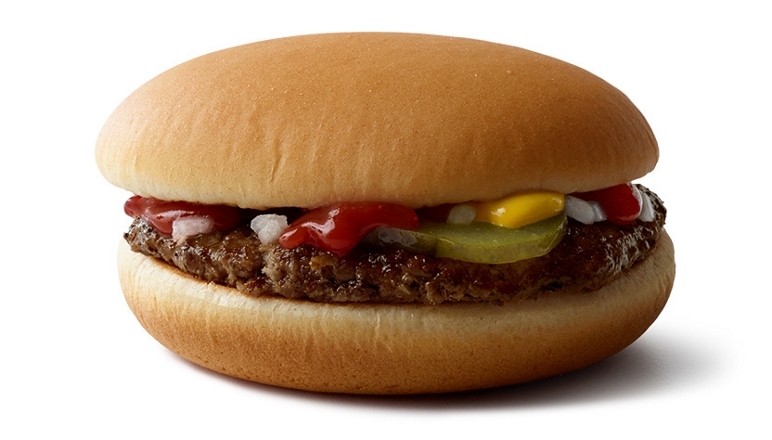
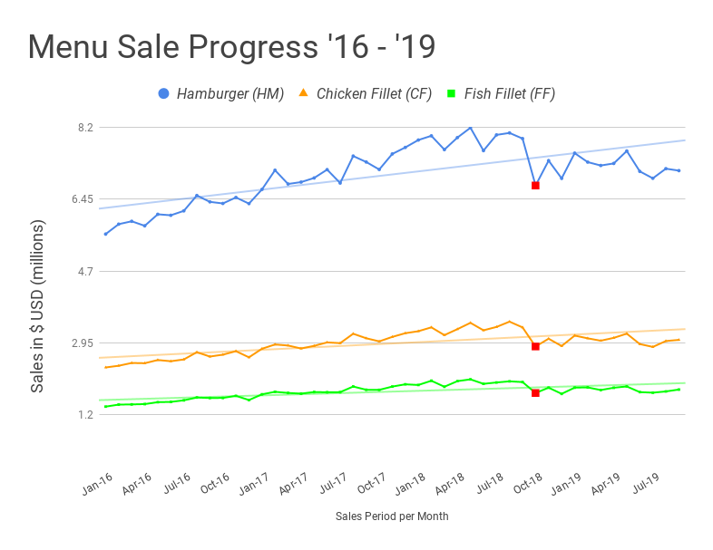
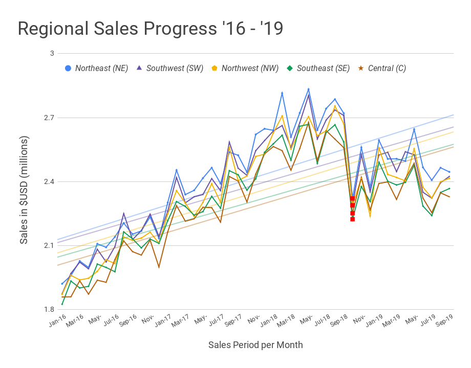

# Introduction

For the past few years, McDonald's burger sales have been increasing steadily, indicating a positive growth.
While this shows that our products continues to be popular among our customers, there is a need for us to analyze our past
accomplishments and suggest any possible improvements we could make to further stabilize our #1 status in the fast food market.

Two datasets will be mainly used for this analysis (monthly_sales, daily_sales) and both sales data will be categorized by two categories: 
the _type of menu_ (**Hamburger**, **Chicken Fillet**, **Fish Fillet**),
and the _broader region_ encompassing the location of each sales (**Northeast**, **Southeast**, **Central**, **Northwest**, **Southwest**). 

# Long-Term Analysis

The following data will go over our **monthly sales** data in _US Dollars_ **$** from **January 2016** to our most recent data from **September 2019**, covering all of the states. 

A brief summary of our overall sales: Hamburgers are our best-selling item, with Chicken Fillet following next and the Fish Fillet after that.
.png)

The overall graph shows a steady increase of sales from 2016 to 2019, but some fluctuation is observable.
February, May and August are the months that we reach peak sales in all five regions, while the months following those months
are typically lower in sales. 

Among those fluctuations, we can see a noticeable drop in October 2018 (highlighted in **red**), which we will discuss in the following paragraph.

## Competitor Influence

In October 2018, our strongest competitor **Burger King** released the **Impossible Burger**, 
a _vegetarian_ option for their signature menu, the Whopper.

The following graph charts show that after the release of the Impossible Burger (Oct 18, corresponding points marked in **red**), 
our overall sales took a critical blow of **14.1%**:

Hamburger sales dropped **14.4%** (from $7.9m USD to $6.8m USD),

SalesDatafrom'16-'19.png)

Chicken Fillet sales dropped **14.0%** (from $3.3m to $2.9m),

SalesDatafrom'16-'19.png)

and Fish Fillet sales dropped **13.3%** (from $2.0m to $1.7m).

SalesDatafrom'16-'19.png)

Although many different factors should be considered for this decrease in sales and there was a slight, consistent decrease in Hamburger sales from September to October in the past years ranging from 2.1% (2016) to 2.5% (2017), it is observable that the Impossible Burger has a significantly negative effect on our sales.

## Solution

Currently, McDonalds does not offer any vegetarian/vegan burger options in the United States, even though we have such options like the [**McVegan**](https://www.today.com/food/mcdonald-s-testing-vegan-burger-finland-t117145), which is available for customers abroad
and gained high popularity. 
I suggest that we expand the sales of McVegan burgers to the U.S. to attract potential customers and sway them from our competitor's vegetarian burgers. 
Another crucial advantage of the McVegan is that this burger is _vegan_ as its name suggests, whereas the Impossible Burger is only _vegetarian_ because it contains mayonnaise. This means that if the McVegan is also sold in the States, it will not only attract vegetarian but also vegan customers. 

It is estimated by the [Vegetarian Times](https://www.vegetariantimes.com/uncategorized/vegetarianism-in-america) 
that about 1 in every 7.3 vegetarians have a vegan-only diet, 
suggesting we could have up to an additional **15.9% influx** of customers (compared to consumers of the Impossible Burger) with the inclusion of the McVegan on our menu.

# Short-Term Analysis

The following content will go over our **daily sales** data in _US Dollars_ **$** from the month of **January, 2016**. 
The sales data will be divided again by two categories: the _type of menu_ and the broader _region_ for each of these sales.
This time, we will explore if there are any discrepancies between the sales depending on the day of the week, or the time of the month
that the purchases were made.

## Sales Comparison Based on _Day of Week_

The data was aggregated as an _average_ per day of week instead of the sum since certain days (Fridays, Saturdays, Sundays) occur more often than others in this month.

The 1st graph shows that there is no significant difference for each day of the week when observing just the overall trend.
However, when looking closely, we can observe that each region has a different sales trend depending on the day of the week.

.png)

## Sales Comparison Based on _Time of the Month_

The data was not aggregated this time as we are trying to see the gradual progress throughout the month. While we only examined the sales pattern based on single weekdays in the past paragraph, we can now see weekly patterns occuring consistently:

.png)

For instance, the Northeast region experiences a boom in sales for every Thursdays and Sundays, 

while the Southwest and Central regions show a steep increase for every Fridays and Mondays.

Stores in the Northwest follow a similar pattern with those regions, but at a slightly slower pace (about 1-2 days late).

## Solution

A possibly effective way to increase more sales per day would be having promotions on days when sales are not as prominent as other days;
if our stores offer in-store promotions for certain items on days that customers are less likely to visit in each area, we can predict that customers may choose to visit their local McDonalds instead of other competing vendors in the area. This would include BOGO offers
or discount on set menus for a higher revenue.

